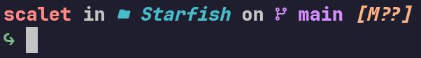
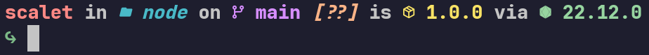

# Starfish

### Motivation

for some reason, the oficial version of [Starship](https://starship.rs/) for fish stopped working on my Pop_OS! 22.04 and Pop_OS! 24.04, so i decided to make a native prompt for fish using my starship configuration, and some others features, like change the icon depending to permission of directory

### Usage

install via fisher

```bash
fisher install rafaScalet/Starfish
```

or copy the [fish_prompt.fish](./functions/fish_prompt.fish) inside `~/.config/fish/functions`

### demo

> in home directory


> in a git directory



> in a node project directory

